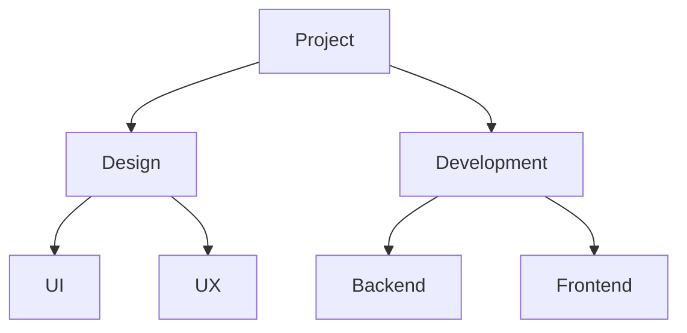

# Markdown list to Mermaid

[](https://www.gnu.org/licenses/gpl-3.0)
[]

`md2mermaid` is a small command-line utility that converts a Markdown list file into a [Mermaid](https://mermaid.js.org/) "graph TD" diagram syntax. It can optionally wrap the output in Markdown code‐fences for direct inclusion in `.md` documents.

## Features

- Parses nested Markdown bullet lists (`-` or `*`) of arbitrary depth  
- Assigns stable node IDs based on nesting and order  
- Emits Mermaid “graph TD” syntax with nodes and arrows  
- Optional Markdown code-fence headers (` ```mermaid ` … ``` )  

## Requirements

- **Java 21** or higher

## Getting Started

### 1. Clone the repository

```bash
git clone https://github.com/hhoao/markdown-list-to-mermaid.git
cd md2mermaid
```

### 2. Build

Build the project with Maven as follows:

```bash
mvn compile
mvn package
# This will produce target/md2mermaid-0.1.0.jar
```

## Usage

```bash
java -jar md2mermaid.jar \
  -i <inputFile.md> \
  -o <outputFile.mmd> \
  [--headers]
```

| Option               | Description                                          |
|----------------------|------------------------------------------------------|
| `-i`, `--input`      | **(required)** Path to the input Markdown file       |
| `-o`, `--output`     | **(required)** Path to write the generated Mermaid file |
| `--headers`          | Wrap output in Markdown code-fences (default: `false`) |

## Examples

### Without headers

Given `tasks.md`:

```markdown
- Project
  - Design
    - UI
    - UX
  - Development
    - Backend
    - Frontend
```

Run:

```bash
java -jar md2mermaid.jar -i tasks.md -o tasks.mmd
```

Produces `tasks.mmd`:

```
graph TD
    A["Project"]
    A --> A1
    A1["Design"]
    A1 --> A1a
    A1a["UI"]
    A1 --> A1b
    A1b["UX"]
    A --> A2
    A2["Development"]
    A2 --> A2a
    A2a["Backend"]
    A2 --> A2b
    A2b["Frontend"]
```

### With headers

```bash
java -jar md2mermaid.jar -i tasks.md -o tasks_with_headers.mmd --headers
```

Produces:



## License

This project is licensed under the **GNU General Public License v3.0** (GPL-3.0).  
See [LICENSE](LICENSE) for the full text.  
